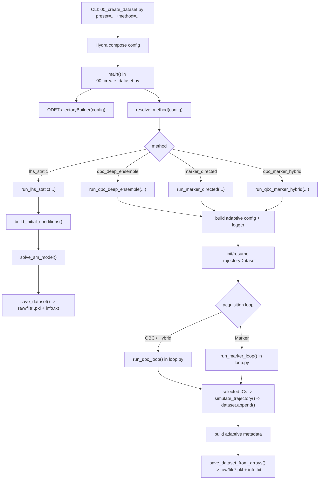

# Dataset Generation Flow

This document describes the current stage-1 dataset generation process (`raw/file*.pkl` + `info.txt`).

## Entry Command

Run stage-1 with:

```bash
PYTHONPATH=. python 00_create_dataset.py preset=<preset> +method=<method>
```

Methods:
- `lhs_static`
- `qbc_deep_ensemble`
- `marker_directed`
- `qbc_marker_hybrid`

Presets live in `src/config/preset/` and provide runtime/output defaults.

## Main Modules

- Entry + dispatch: `00_create_dataset.py`
- Orchestration + builder + writer: `src/data/generate/dataset_functions.py`
- QBC + marker loops: `src/methods/loop.py`
- Acquisition utilities (regular + hybrid): `src/methods/acquisition.py`
- Marker features/selection utils: `src/methods/marker_utils.py`
- Adaptive logging/checkpoints: `src/methods/logger.py`
- ODE simulation utility: `src/sim/simulator.py`
- Adaptive metadata assembly: `src/data/generate/adaptive_metadata.py`
- Dataset state container: `src/data/loaders/trajectory_dataset.py`

## Functional Stages

1. Hydra config composition (`setup_dataset` + `preset` + `method`).
2. Method resolution + validation.
3. IC generation:
   - static: full-factorial or joint LHS table
   - adaptive: initial pool + candidate pools per round
4. ODE simulation to trajectories.
5. Acquisition (adaptive only): QBC/marker/hybrid selection of new ICs.
6. Dataset state updates (`append`, train/test views).
7. Optional adaptive logging/checkpointing.
8. Metadata creation for `info.txt`.
9. Raw contract writing:
   - `.../dataset_vN/raw/file*.pkl`
   - `.../dataset_vN/info.txt`

## Flowchart



## Notes

- Adaptive round logs are throttled via `active.log_every` (default: `5`).
- The final output contract is identical across methods (`raw/` + `info.txt`).
