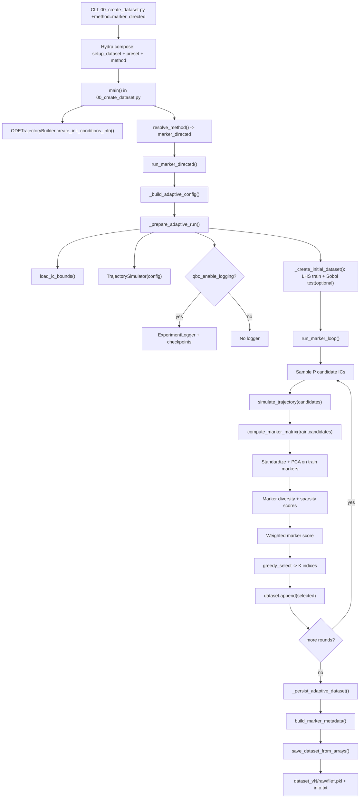

# Marker-Directed Dataset Generation (`00_create_dataset.py`)

This document explains how `marker_directed` runs inside stage-1 dataset creation, including algorithm steps, code dependencies, and output structure.

## Scope

Method covered: `experiment.method=marker_directed`

Entry point:

```bash
PYTHONPATH=. python 00_create_dataset.py +method=marker_directed preset=<preset>
```

This method requires:

- `model.ic_generation_method=adaptive_iterative`

## End-to-End Algorithm

1. Hydra composes runtime config from `setup_dataset.yaml`, selected `preset`, and `+method=marker_directed`.
2. `00_create_dataset.py` creates `ODETrajectoryBuilder` and dispatches via `resolve_method(...)` and `run_method(...)`.
3. `run_marker_directed(...)` builds `AdaptiveConfig` from budget/runtime parameters:
   - `qbc_n0`, `qbc_P`, `qbc_K`, `qbc_T`, seed, logging flags.
4. Adaptive prep validates `adaptive_iterative`, loads IC bounds, initializes `TrajectorySimulator`, and optionally creates `ExperimentLogger`.
5. Initial dataset is created from ODE simulations:
   - Train seed set: `qbc_n0` ICs sampled with LHS.
   - Optional test set: `qbc_n_test` ICs sampled with Sobol.
6. Marker loop (`run_marker_loop`) runs for `qbc_T` rounds:
   - Sample `qbc_P` candidate ICs (`active.candidate_method`).
   - Simulate all candidates with ODE solver.
   - Build marker features for train and candidate trajectories.
   - Standardize marker features using train statistics.
   - Fit PCA on train markers (`active.marker.pca_explained_variance`) and project train/candidates.
   - Compute marker-based novelty signals:
     - Diversity: distance to nearest train trajectory in marker embedding.
     - Sparsity: mean distance to `k_density` nearest train trajectories.
   - Create combined marker score:
     - weighted normalized sum of diversity and sparsity (`active.marker.weights.*`).
   - Select `qbc_K` candidates with `greedy_select` over a preselected top-score pool.
   - Append selected trajectories to dataset.
   - Optional evaluation: train a small ensemble for held-out test metrics when `qbc_n_test > 0` and eval policy is enabled.
   - Optional round logging/checkpointing.
7. Final dataset is exported via `save_dataset_from_arrays(...)` using the same raw dataset contract as other methods.
8. `info.txt` is enriched with marker metadata (`build_marker_metadata`).

## Flowchart



## Internal File Dependencies (Method Path)

### Entry and orchestration

- `00_create_dataset.py`
- `src/data/generate/dataset_functions.py`

Core functions:
- `resolve_method`, `run_method`, `run_marker_directed`
- `_prepare_adaptive_run`, `_create_initial_dataset`, `_run_marker_adaptive`, `_persist_adaptive_dataset`

### Marker loop and selection logic

- `src/data/active_learning/loop.py`
  - `run_marker_loop`
- `src/data/active_learning/marker_utils.py`
  - `compute_marker_matrix`, `fit_pca`, `pca_transform`, `normalize01`, `greedy_select`
- `src/data/active_learning/ensemble.py`
  - `train_ensemble` (used only for optional held-out evaluation)
- `src/training/trainer.py`
  - `train_surrogate` (evaluation ensemble members)

### Simulation, dataset state, and IC sampling

- `src/sim/simulator.py` (`TrajectorySimulator.simulate_trajectory`)
- `src/data/loaders/trajectory_dataset.py` (`TrajectoryDataset` and `append`)
- `src/data/generate/ic_sampler.py` (`sample_initial_ics`)
- `src/data/generate/bounds.py` (`load_ic_bounds`)

### Logging, metadata, and raw contract

- `src/data/active_learning/logger.py` (`ExperimentLogger`)
- `src/data/generate/adaptive_metadata.py` (`build_marker_metadata`)
- `src/data/contracts/data_contract.py` (raw trajectory contract validation)

## Config Dependency Graph

Primary config files:

- `src/config/setup_dataset.yaml`
- `src/config/method/marker_directed.yaml`
- `src/config/qbc_active/default.yaml` (shared defaults such as `active.log_every`)
- `src/config/preset/<preset>.yaml` (budgets/output roots)
- `src/config/ic/<MODEL>/init_cond*.yaml`
- `src/config/ic/modellings_guide.yaml`

Key runtime knobs for marker generation:

- Budget controls: `qbc_n0`, `qbc_P`, `qbc_K`, `qbc_T`, `qbc_n_test`
- Candidate generation: `active.candidate_method`
- Marker feature and selection behavior:
  - `active.marker.pca_explained_variance`
  - `active.marker.k_density`
  - `active.marker.preselect_factor`
  - `active.marker.greedy_score_weight`
  - `active.marker.settling_fraction`
  - `active.marker.include_anchor_state_markers`
  - `active.marker.weights.diversity`
  - `active.marker.weights.sparsity`
- Optional evaluation controls:
  - `active.marker.eval_members`
  - `active.marker.eval_every_round`
- Logging/resume controls:
  - `qbc_enable_logging`, `qbc_run_dir`

Note: parameter names keep the `qbc_*` prefix for historical compatibility, but they are also used by `marker_directed`.

## Data and Artifact Structure

### Final dataset output (always produced)

```text
<dataset_dir>/<MODEL>/dataset_vN/
  info.txt
  raw/
    file<idx>.pkl
```

`raw/file*.pkl` uses the same contract as QBC/static generation: each trajectory record stores `[time, state_1, state_2, ...]`.

### Optional marker run artifacts (if logging enabled)

```text
<qbc_run_dir>/
  config.yaml
  history.jsonl
  rounds/
    round_000/
      candidate_ics.npy
      scores.npy
      selected_indices.npy
      selected_ics.npy
      marker_diversity.npy
      marker_sparsity.npy
      marker_embedding.npy
      marker_train_embedding.npy
  checkpoints/
    dataset_round_*.npz
    dataset_final.npz
```

## Practical Notes

- Final training size follows the same budget identity:
  - `final_n = qbc_n0 + qbc_K * qbc_T`
- Unlike QBC, marker-directed acquisition simulates all `P` candidates each round to compute marker features.
- Held-out metrics (`eval_mse`/`eval_rmse`) are optional and depend on `qbc_n_test` plus marker eval settings.
- Resume-from-round is currently blocked for marker-directed in `_build_adaptive_config`.
