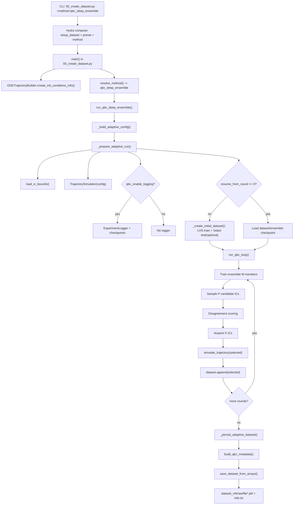

# QBC Deep Ensemble Dataset Generation (`00_create_dataset.py`)

This document explains how `qbc_deep_ensemble` is executed inside the stage-1 dataset creation pipeline, including the algorithm steps, file dependencies, and output structure.

## Scope

Method covered: `experiment.method=qbc_deep_ensemble`

Entry point:

```bash
PYTHONPATH=. python 00_create_dataset.py +method=qbc_deep_ensemble preset=<preset>
```

This method requires:

- `model.ic_generation_method=adaptive_iterative`

If `ic_generation_method` is `full_factorial` or `joint_lhs`, the static `lhs_static` path is used instead.

## End-to-End Algorithm

1. Hydra composes runtime config from `setup_dataset.yaml`, selected `preset`, and `+method=qbc_deep_ensemble`.
2. `00_create_dataset.py` creates `ODETrajectoryBuilder` and calls `resolve_method(...)` / `run_method(...)`.
3. `run_qbc_deep_ensemble(...)` builds `AdaptiveConfig` (`qbc_n0`, `qbc_M`, `qbc_P`, `qbc_K`, `qbc_T`, logging/resume flags).
4. Adaptive prep validates `adaptive_iterative`, loads IC bounds, creates `TrajectorySimulator`, and optionally creates `ExperimentLogger`.
5. Initial dataset is created:
   - Train seed set: `qbc_n0` ICs sampled by LHS.
   - Optional held-out test set: `qbc_n_test` ICs sampled by Sobol.
   - Both are simulated with ODE solves and wrapped in `TrajectoryDataset`.
6. QBC loop runs for `qbc_T` rounds:
   - Train deep ensemble with `qbc_M` surrogate members.
   - Sample `qbc_P` candidate ICs (`active.candidate_method`).
   - Score disagreement (`active.disagreement.metric`) from ensemble predictions.
   - Select `qbc_K` ICs using:
     - `qbc_only`: uncertainty-only or uncertainty+IC-space diversity (`acquire_diverse`).
     - `qbc_marker_hybrid` (same loop engine, different acquisition strategy): marker-informed hybrid score.
   - Simulate selected ICs with ODE solver.
   - Append new trajectories to training set.
   - Optionally evaluate on held-out test set and log round artifacts/checkpoints.
7. Final adaptive dataset (`dataset.train_ics`, `dataset.train_trajs`) is exported through `save_dataset_from_arrays(...)` using the raw dataset contract.
8. `info.txt` includes QBC metadata (budgets, disagreement metric, selection settings, source run dir).

## Flowchart



## Internal File Dependencies (Method Path)

### Entry and dispatch

- `00_create_dataset.py`
- `src/data/generate/dataset_functions.py`

Key functions:
- `resolve_method`, `run_method`, `run_qbc_deep_ensemble`
- `_prepare_adaptive_run`, `_create_initial_dataset`, `_persist_adaptive_dataset`

### Adaptive QBC loop and acquisition

- `src/methods/loop.py`
  - `QBCConfig.from_runtime`
  - `run_qbc_loop`
- `src/methods/ensemble.py`
  - `train_ensemble`, `DeepEnsemble.predict_all/predict_mean`
- `src/train/trainer.py`
  - `train_surrogate` (each committee member)
- `src/methods/disagreement.py`
  - `score_disagreement`
- `src/methods/acquisition.py`
  - `acquire_topk`, `acquire_diverse`, `select_qbc_marker_hybrid`

### Simulation and data container

- `src/sim/simulator.py` (`TrajectorySimulator.simulate_trajectory`)
- `src/data/loaders/trajectory_dataset.py` (`TrajectoryDataset.append`, train/test views)
- `src/data/generate/ic_sampler.py` (LHS/Sobol/random IC sampling)
- `src/data/generate/bounds.py` (IC bounds from init condition YAML)

### Logging/checkpointing and final metadata

- `src/methods/logger.py` (`ExperimentLogger`)
- `src/data/generate/adaptive_metadata.py` (`build_qbc_metadata`)
- `src/data/contracts/data_contract.py` (raw dataset serialization contract validation)

## Config Dependency Graph

Primary configs for this method:

- `src/config/setup_dataset.yaml` (base runtime schema)
- `src/config/method/qbc_deep_ensemble.yaml` (sets `experiment.method`, forces `adaptive_iterative`)
- `src/config/qbc_active/default.yaml` (QBC behavior defaults)
- `src/config/preset/<preset>.yaml` (budgets/output dirs, e.g. `main.yaml`)
- `src/config/ic/<MODEL>/init_cond*.yaml` (IC bounds)
- `src/config/ic/modellings_guide.yaml` (state/key definitions)

Most influential knobs for generation behavior:

- Budget: `qbc_n0`, `qbc_P`, `qbc_K`, `qbc_T`, `qbc_M`, `qbc_n_test`
- Candidate generation: `active.candidate_method`
- Disagreement: `active.disagreement.metric`
- Diversity policy (`qbc_only` path):
  - `active.diversify`
  - `active.diversity.*`
- Optional hybrid policy:
  - `active.acquisition_strategy=qbc_marker_hybrid`
  - `active.hybrid.*`
- Reproducibility/control: `model.seed`, `surrogate.deterministic*`
- Optional resumable logging: `qbc_enable_logging`, `qbc_run_dir`, `qbc_resume_*`

## Data and Artifact Structure

### Final dataset output (always produced)

Configured root (typically via `dirs.dataset_dir`) contains:

```text
<dataset_dir>/<MODEL>/dataset_vN/
  info.txt
  raw/
    file<idx>.pkl
```

`raw/file*.pkl` records follow the raw data contract:
- each trajectory record is `[time, state_1, state_2, ...]`

### Optional QBC run artifacts (only if logging enabled)

```text
<qbc_run_dir>/
  config.yaml
  history.jsonl
  rounds/
    round_000/
      candidate_ics.npy
      scores.npy
      selected_indices.npy
      selected_ics.npy
      ... optional marker/hybrid arrays
  checkpoints/
    dataset_round_*.npz
    ensemble_round_*/member_*.pt
    dataset_final.npz
```

## Practical Notes

- Final training size is deterministic from budget settings:
  - `final_n = qbc_n0 + qbc_K * qbc_T`
- `qbc_n_test > 0` enables `eval_mse`/`eval_rmse` round metrics.
- Candidate IC scoring is surrogate-only; ODE solves happen only for selected `K` per round.
- `qbc_deep_ensemble` and `qbc_marker_hybrid` share the same loop engine (`run_qbc_loop`) and differ by acquisition strategy.
