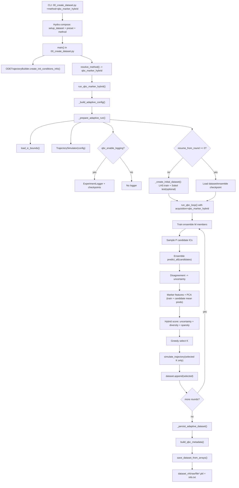

# QBC Marker-Hybrid Dataset Generation (`00_create_dataset.py`)

This document explains how `qbc_marker_hybrid` executes in stage-1 dataset creation, including algorithm steps, dependencies, and output structure.

## Scope

Method covered: `experiment.method=qbc_marker_hybrid`

Entry point:

```bash
PYTHONPATH=. python 00_create_dataset.py +method=qbc_marker_hybrid preset=<preset>
```

This method requires:

- `model.ic_generation_method=adaptive_iterative`

## End-to-End Algorithm

1. Hydra composes runtime config from `setup_dataset.yaml`, selected `preset`, and `+method=qbc_marker_hybrid`.
2. `00_create_dataset.py` creates `ODETrajectoryBuilder`, resolves method, and dispatches to `run_qbc_marker_hybrid(...)`.
3. `run_qbc_marker_hybrid(...)` builds `AdaptiveConfig` from runtime budgets:
   - `qbc_n0`, `qbc_M`, `qbc_P`, `qbc_K`, `qbc_T`, seed, logging/resume flags.
4. Adaptive prep validates `adaptive_iterative`, loads IC bounds, initializes `TrajectorySimulator`, and optionally enables `ExperimentLogger`.
5. Initial dataset is created:
   - Train seed set: `qbc_n0` ICs sampled with LHS.
   - Optional held-out test set: `qbc_n_test` ICs sampled with Sobol.
6. QBC loop (`run_qbc_loop`) runs for `qbc_T` rounds with `active.acquisition_strategy=qbc_marker_hybrid`:
   - Train deep ensemble (`qbc_M` members).
   - Sample `qbc_P` candidate ICs (`active.candidate_method`).
   - Predict all candidate trajectories with ensemble (no ODE solve yet).
   - Compute uncertainty scores via disagreement metric.
   - Build marker features from:
     - current train trajectories (ODE-simulated), and
     - candidate predicted mean trajectories (surrogate outputs).
   - Standardize marker features by train statistics and fit PCA on train markers.
   - Compute marker diversity/sparsity signals in PCA space.
   - Build hybrid score:
     - weighted normalized combination of uncertainty + marker diversity + marker sparsity (`active.hybrid.weights.*`).
   - Select `qbc_K` candidates with greedy selection over the preselected top pool.
   - Run ODE solver only for selected `K` ICs and append to dataset.
   - Optionally evaluate held-out test metrics (`qbc_n_test > 0`) and write round artifacts/checkpoints.
7. Final dataset is exported via `save_dataset_from_arrays(...)` using the raw dataset contract.
8. `info.txt` metadata is written via `build_qbc_metadata(...)`, including hybrid hyperparameters.

## Flowchart



## Internal File Dependencies (Method Path)

### Entry and orchestration

- `00_create_dataset.py`
- `src/data/generate/dataset_functions.py`

Core functions:
- `run_qbc_marker_hybrid`, `_build_adaptive_config`, `_prepare_adaptive_run`
- `_create_initial_dataset`, `_persist_adaptive_dataset`

### QBC loop + hybrid acquisition

- `src/data/active_learning/loop.py`
  - `QBCConfig.from_runtime`
  - `run_qbc_loop` (branch: `acquisition_strategy == qbc_marker_hybrid`)
- `src/data/active_learning/ensemble.py`
  - `train_ensemble`, `DeepEnsemble.predict_all/predict_mean`
- `src/training/trainer.py`
  - `train_surrogate`
- `src/data/active_learning/disagreement.py`
  - `score_disagreement`
- `src/data/active_learning/acquisition.py`
  - `select_qbc_marker_hybrid`
- `src/data/active_learning/marker_utils.py`
  - marker matrix construction, standardization, PCA, greedy selection

### Simulation, IC sampling, and dataset state

- `src/sim/simulator.py` (`TrajectorySimulator.simulate_trajectory`)
- `src/data/generate/ic_sampler.py` (`sample_initial_ics`)
- `src/data/generate/bounds.py` (`load_ic_bounds`)
- `src/data/loaders/trajectory_dataset.py` (`TrajectoryDataset.append`)

### Logging, metadata, and raw contract

- `src/data/active_learning/logger.py` (`ExperimentLogger`)
- `src/data/generate/adaptive_metadata.py` (`build_qbc_metadata`)
- `src/data/contracts/data_contract.py` (trajectory contract validation)

## Config Dependency Graph

Primary files:

- `src/config/setup_dataset.yaml`
- `src/config/method/qbc_marker_hybrid.yaml`
- `src/config/qbc_active/default.yaml`
- `src/config/preset/<preset>.yaml`
- `src/config/ic/<MODEL>/init_cond*.yaml`
- `src/config/ic/modellings_guide.yaml`

Most influential knobs:

- Budget: `qbc_n0`, `qbc_M`, `qbc_P`, `qbc_K`, `qbc_T`, `qbc_n_test`
- Candidate generation: `active.candidate_method`
- Uncertainty metric: `active.disagreement.metric`
- Hybrid marker controls:
  - `active.acquisition_strategy=qbc_marker_hybrid`
  - `active.hybrid.pca_explained_variance`
  - `active.hybrid.k_density`
  - `active.hybrid.preselect_factor`
  - `active.hybrid.greedy_score_weight`
  - `active.hybrid.settling_fraction`
  - `active.hybrid.include_anchor_state_markers`
  - `active.hybrid.weights.uncertainty|diversity|sparsity`
- Logging/resume: `qbc_enable_logging`, `qbc_run_dir`, `qbc_resume_*`

## Data and Artifact Structure

### Final dataset output (always produced)

```text
<dataset_dir>/<MODEL>/dataset_vN/
  info.txt
  raw/
    file<idx>.pkl
```

### Optional hybrid run artifacts (if logging enabled)

```text
<qbc_run_dir>/
  config.yaml
  history.jsonl
  rounds/
    round_000/
      candidate_ics.npy
      scores.npy
      selected_indices.npy
      selected_ics.npy
      hybrid_uncertainty.npy
      hybrid_diversity.npy
      hybrid_sparsity.npy
      hybrid_score.npy
      hybrid_embedding.npy
      hybrid_train_embedding.npy
  checkpoints/
    dataset_round_*.npz
    ensemble_round_*/member_*.pt
    dataset_final.npz
```

## Practical Notes

- Final training size: `final_n = qbc_n0 + qbc_K * qbc_T`.
- Hybrid keeps QBC's solver efficiency: ODE solves are only done for selected `K` samples per round.
- Marker signals in hybrid are computed from surrogate-predicted candidate trajectories, not from ODE-simulated full candidate pools.
- Metadata in `info.txt` includes hybrid-specific knobs when acquisition strategy is `qbc_marker_hybrid`.
